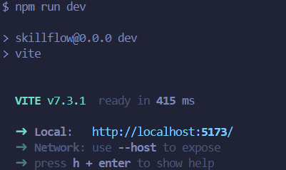

SkillFlow to frontend aplikacji webowej do wymiany umiejętności między użytkownikami.  
Celem projektu jest stworzenie intuicyjnej platformy, która umożliwi użytkownikom:

- prezentowanie swoich umiejętności,
- wyszukiwanie innych osób do nauki,
- przechodzenie przez podstawowe widoki aplikacji,
- rozwój projektu w kierunku pełnej platformy społecznościowo-edukacyjnej.

Aktualna wersja projektu została przygotowana w oparciu o **React + Vite** i stanowi bazę pod dalszy rozwój aplikacji.

---

# Spis treści

<a id="spis-tresci"></a>

1. [Opis projektu](#opis-projektu)
2. [Technologie](#technologie)
3. [Wymagania](#wymagania)
4. [Pierwsze uruchomienie projektu lokalnie](#pierwsze-uruchomienie-projektu-lokalnie)
5. [Aktualizacja istniejącego lokalnego repozytorium](#aktualizacja-istniejącego-lokalnego-repozytorium)
6. [Build produkcyjny](#build-produkcyjny)
7. [Struktura projektu](#struktura-projektu)
8. [Aktualne funkcjonalności](#aktualne-funkcjonalności)
9. [Workflow pracy w zespole](#workflow-pracy-w-zespole)
10. [Praca z branchami](#praca-z-branchami)
11. [Commitowanie zmian](#commitowanie-zmian)
12. [Push zmian na GitHub](#push-zmian-na-github)
13. [Pull Request](#pull-request)
14. [Checklist przed pushem](#checklist-przed-pushem)
15. [Najczęstsze problemy](#najczęstsze-problemy)
16. [Dobre praktyki](#dobre-praktyki)
17. [Pliki ignorowane przez Git](#pliki-ignorowane-przez-git)

---

# Opis projektu

Projekt **SkillFlow** powstaje jako aplikacja frontendowa, która w przyszłości może zostać rozbudowana o backend, autoryzację użytkowników, komunikację, profile użytkowników i dodatkowe moduły.

Na obecnym etapie projekt zawiera:

- stronę główną,
- przejście do rejestracji,
- przejście do logowania,
- formularz rejestracji,
- formularz logowania,
- podstawową strukturę komponentów w React.

Projekt został przygotowany tak, aby można było go rozwijać zespołowo i wygodnie utrzymywać w repozytorium GitHub.

##### [↑ Powrót do spisu treści](#spis-tresci)

---

# Technologie

Projekt wykorzystuje następujące technologie:

- **React** – do budowy interfejsu użytkownika,
- **Vite** – do szybkiego uruchamiania i budowania aplikacji,
- **JavaScript (ES6+)** – logika aplikacji,
- **CSS** – stylowanie komponentów,
- **Git + GitHub** – kontrola wersji i współpraca zespołowa.

##### [↑ Powrót do spisu treści](#spis-tresci)

---

# Wymagania

Aby uruchomić projekt lokalnie, potrzebujesz:

- zainstalowanego **Node.js**
- zainstalowanego **npm**
- zainstalowanego **Git**
- dostępu do repozytorium GitHub

## Sprawdzenie wersji

W terminalu możesz sprawdzić:

```bash
node -v
npm -v
git --version
```

##### [↑ Powrót do spisu treści](#spis-tresci)

---

# Pierwsze uruchomienie projektu lokalnie

Poniższe kroki wykonujesz, jeśli pobierasz projekt po raz pierwszy na swój komputer.

1. Sklonuj repozytorium

```
git clone https://github.com/cassablanca/SkillFlow.git
```

2. Wejdź do folderu projektu

```
cd SkillFlow
```

3. Zainstaluj zależności

```
npm install
```

Ta komenda pobierze wszystkie wymagane paczki z pliku package.json.

4. Uruchom aplikację lokalnie

```
npm run dev
```

Po uruchomieniu Vite w terminalu pojawi się adres lokalny, najczęściej:

http://localhost:5173



Otwórz go w przeglądarce.

##### [↑ Powrót do spisu treści](#spis-tresci)

---

# Aktualizacja istniejącego lokalnego repozytorium

1. Wejdź do folderu projektu

```
cd SkillFlow
```

2. Przełącz się na główną gałąź

```
git checkout main
```

3. Pobierz najnowsze zmiany

```
git pull origin main
```

4. Jeśli doszły nowe zależności, zainstaluj je

```
npm install
```

5. Uruchom projekt

```
npm run dev
```

##### [↑ Powrót do spisu treści](#spis-tresci)

---

# Build produkcyjny

Aby sprawdzić, czy projekt buduje się poprawnie:

```
npm run build
```

Jeśli build zakończy się sukcesem, oznacza to, że aplikacja jest gotowa do zbudowania w wersji produkcyjnej.

Aby podejrzeć wersję produkcyjną lokalnie:

```
npm run preview
```

##### [↑ Powrót do spisu treści](#spis-tresci)

---

# Struktura projektu

Przykładowa struktura projektu:

```
SkillFlow/
├── public/
│   └── logo.jpg
├── src/
│   ├── components/
│   │   ├── Footer.jsx
│   │   ├── HomePage.jsx
│   │   ├── LoginPage.jsx
|   |   ├── Icons.jsx
│   │   ├── Navbar.jsx
│   │   └── RegisterPage.jsx
│   ├── App.jsx
│   ├── index.css
│   └── main.jsx
├── .gitignore
├── README.md
├── package.json
├── package-lock.json
├── vite.config.js
└── index.html
```

Krótkie wyjaśnienie:

- public/ – pliki statyczne, np. logo
- src/ – kod źródłowy aplikacji
- components/ – komponenty React
- App.jsx – główny komponent aplikacji
- main.jsx – punkt wejścia aplikacji
- index.css – globalne style
- package.json – zależności i skrypty projektu
- .gitignore – pliki ignorowane przez Git
- README.md – dokumentacja projektu

##### [↑ Powrót do spisu treści](#spis-tresci)

---

# Aktualne funkcjonalności

Na obecnym etapie projekt zawiera:

- stronę główną aplikacji,
- nawigację między widokami,
- sekcję hero na stronie głównej,
- sekcję benefitów,
- formularz rejestracji,
- formularz logowania,
- podstawową walidację formularza rejestracji,
- wspólny navbar i footer.

##### [↑ Powrót do spisu treści](#spis-tresci)

---

# Workflow pracy w zespole

W projekcie pracujemy na feature branchach.
Nie wrzucamy kodu bezpośrednio do main.

Schemat pracy wygląda tak:

- przejście na main,
- pobranie najnowszych zmian,
- utworzenie nowego brancha pod konkretne zadanie,
- wykonanie zmian,
- commit,
- push na własny branch,
- utworzenie Pull Requesta,
- review,
- merge do main.

##### [↑ Powrót do spisu treści](#spis-tresci)

---

# Praca z branchami

1. Przejdź na branch main

```
git checkout main
```

2. Pobierz najnowsze zmiany

```
git pull origin main
```

3. Utwórz nowy branch do swojego zadania

Przykład:

```
git checkout -b feature/register-page
```

Możesz też używać nazw typu:

```
git checkout -b feature/homepage-layout
git checkout -b feature/login-form
git checkout -b feature/navbar-refactor
```

Dobre nazwy branchy

- feature/register-page
- feature/login-page
- feature/homepage
- feature/form-validation

Słabe nazwy branchy

- test
- nowybranch
- zmiany
- projekt1

Branch powinien jasno mówić, nad czym pracujesz.

##### [↑ Powrót do spisu treści](#spis-tresci)

---

# Commitowanie zmian

Po wprowadzeniu zmian:

1. Sprawdź status plików

```
git status
```

2. Dodaj zmienione pliki

```
git add .
```

3. Zrób commit

```
git commit -m "Add register page with basic validation"
```

Dobre commit message

- Add homepage layout
- Create register form
- Add login page
- Refactor navbar component
- Fix register form validation

Słabe commit message

- zmiany
- update
- fix
- projekt

Commit powinien krótko opisywać, co zostało zrobione.

##### [↑ Powrót do spisu treści](#spis-tresci)

---

# Push zmian na GitHub

Po wykonaniu commita wyślij branch na GitHuba:

```
git push -u origin feature/register-page
```

Flaga -u ustawia powiązanie lokalnego brancha ze zdalnym.

Przy kolejnych pushach zazwyczaj wystarczy:

```
git push
```

##### [↑ Powrót do spisu treści](#spis-tresci)

---

# Pull Request

Po zakończeniu pracy:

- wejdź na GitHub do repozytorium,
- wybierz swój branch,
- kliknij Compare & pull request,
- opisz, co zostało zmienione,
- wyślij Pull Request do main.
- Co powinien zawierać dobry Pull Request?
- krótki opis zmian,
- informację, co zostało dodane,
- informację, co zostało poprawione,
- ewentualnie screenshot, jeśli zmiany są wizualne.

Przykład opisu PR

Dodałem stronę rejestracji oraz podstawową walidację pól:

- email wymagany
- hasło wymagane
- potwierdzenie hasła musi być zgodne

**Po review i akceptacji można zrobić merge.**

##### [↑ Powrót do spisu treści](#spis-tresci)

---

# Checklist przed pushem

Zanim wypchniesz branch, sprawdź czy:

- projekt uruchamia się przez npm run dev
- projekt buduje się przez npm run build
- nie wrzucasz node_modules
- nie wrzucasz dist
- nie wrzucasz plików .env
- commit message ma sens
- branch ma dobrą nazwę
- kod nie zawiera przypadkowych console.log, jeśli nie są potrzebne

##### [↑ Powrót do spisu treści](#spis-tresci)

---

# Najczęstsze problemy

1. npm install nie działa

Sprawdź:

- czy jesteś w folderze projektu,
- czy masz zainstalowany Node.js,
- czy masz dostęp do internetu.

2. npm run dev nie uruchamia projektu

Sprawdź:

- czy zależności zostały zainstalowane,
- czy nie ma błędu w kodzie,
  czy terminal nie pokazuje informacji o brakujących paczkach.

3. Konflikt przy git pull

Oznacza to, że ktoś zmienił te same pliki co Ty.
Wtedy trzeba rozwiązać konflikt ręcznie i dopiero wykonać kolejny commit.

4. Przypadkowo jesteś na main

Przełącz się na nowy branch:

git checkout -b feature/nazwa-zadania

Jeśli masz już zmiany lokalne, Git powinien przenieść je razem.

##### [↑ Powrót do spisu treści](#spis-tresci)

---

# Dobre praktyki

- nie commitujemy node_modules,
- nie commitujemy plików środowiskowych .env,
- nie commitujemy dist,
- każdy większy task robimy na osobnym branchu,
- nie wrzucamy wszystkiego w jeden ogromny commit,
- przed pushowaniem sprawdzamy lokalnie, czy projekt działa,
- staramy się utrzymywać czytelną strukturę folderów.

##### [↑ Powrót do spisu treści](#spis-tresci)

---

# Pliki ignorowane przez Git

Plik .gitignore powinien ignorować m.in.:

- node_modules/
- dist/
- .env
- pliki logów
- pliki edytorów (.vscode/, .idea/)
- pliki systemowe (.DS_Store, Thumbs.db)

Dzięki temu do repozytorium trafiają tylko potrzebne pliki.

##### [↑ Powrót do spisu treści](#spis-tresci)
